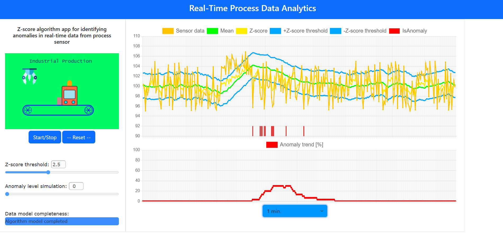
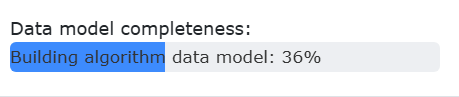
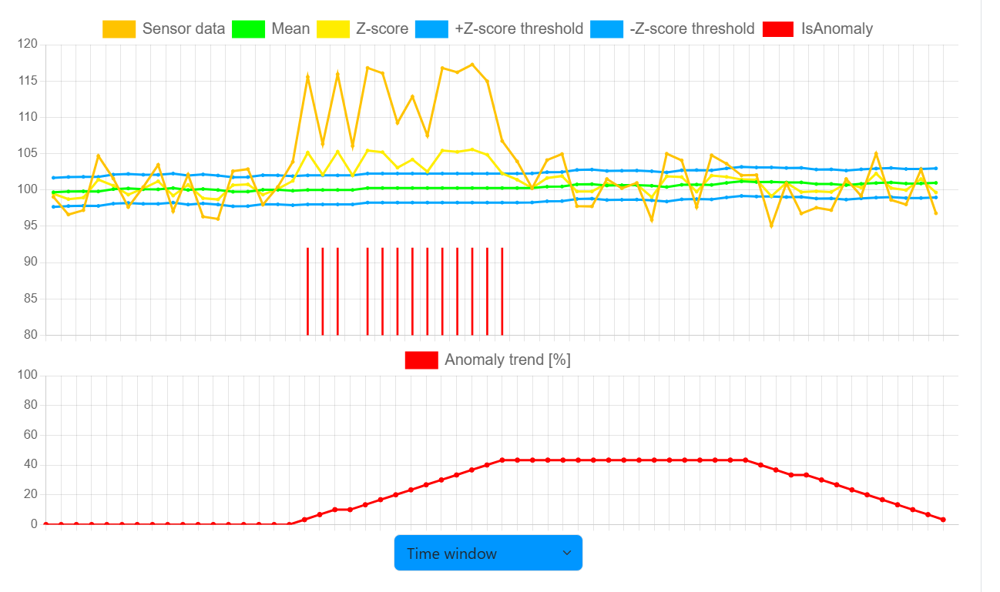

# Real-time process data analytics
#### Video Demo:  https://youtu.be/K3X0o1O67XU
#### Description:

This project simulates industrial sensor data and applies z-score algorithm on it to detect anomaly on its output.

Technology stack used in the project includes: Flask, Python, Javascript, Bootstrap, HTML, CSS.



On the left-top of the app screen, there is animation of industrial manufacturing designed in JavaScript.
It should depict an area where different sensors measure conditions like vibration, energy usage, temperature etc.
The industrial process animation can be started and stopped with press button.

Data generated by the sensor (let's assume it's vibration sensor) are simulated by Python code and special algorithm
called z-score is applied on the collected data.

The idea behind the algorithm is as follows:
Defined number (`MODEL_SIZE`) of sensor measurements are gathered. Next, statistics are calculated on this data model and these are: mean(avarage) value, standard deviation. In next step, each measured point from sensor is evaluated and z-score value is calculated according to the formula:
```
z-score = (sensor_value - avarage) / std_dev.
```

To detect anomaly, there is so called `Z-score threshold` value introduced. This value is set up on the app screen by slider. If the calculated `z-score` value for single sensor data is above `z-score threshold` it means the measured sensor data can be treated as anomaly and it is just marked on the chart. If the calculated `z-score` value is below z-score threshold it means it is not a anomaly and the data model will be recalculated in this way that the measured sensor point is appended to the data model and the first point in the data model is deleted. Next the avarage and standard deviation for the data model are recalculated. This ensures real-time data evaluation. By the next sensor data point the same game begins again and again.

The app simulates sensor data in given range. To add some signal noise to the sensor data a slider `Anomaly level simulation` can be used.
This adds some offset and random data to the simulated sensor data. The higher the slider value, the higher is the added random noise.

The app can be started with `Start/Stop` button. This starts sensor data simulation and data model is build and the beginning. The progress of the data model completetion is displayed via progress bar `Data model completeness`:



After the data model is calculated the results of algorithm are shown on the charts.
All sensor measurements, data model calculation and algorithm results are stored into sqlite database.
This way it's possible to observe historical values. Select element `Time window` is used to define the how many data points from history are depicted on the chart.

The upper chart shows sensor output(orange line), calculated mean (green line) value, z-score (yellow line) and +z/-z threshold added to the mean value. This way the charts displays if calculated z-score value is within ranges mean +- z-score threshold. If it is above the threshold value an anomaly is marked by bar on the same chart (red mark).




However it would be annoying for a human user to observe (and count) how many anomalies occured during given time window. And therefore the bottom chart shows accumulated value of anomalies for given number of last data points `ANOMALY_LIST_SIZE`. It enables to gain general insight about anomaly trend of the observed sensor.
\
\
\
**Running the app**

Start Flask app:
```
$ flask run
```
\
\
**Codes description**
\
\
`app.py`
\
It is Flask application.
Its purpose is to create connection to sqlite DB, it creates object for anomaly detection algorithm.
The sensor signal simulation is running in thread, independent of all GET / POST routes.

The route `/get_data` sends response to the JavaScript client with algorithm result data (query from sqlite)

The route `/send_control` handles control commands and application settings sent from Javascript client to keep track of it on the server-side.

The route `/get_control` is called when Flask app starts first time or the web page is reloaded to transfer current command and application settings from server to the client.

Data between server and client is exchanged using JSON format.

`helpers.py`
\
Python module with classes for anomaly algorithm implementation and control commands.
\
\
`data.db`
\
sqlite3 database with table `SensorData` where all sensor data and algorithm results are stored.
Table schema:
```
CREATE TABLE 'SensorData' (
id INTEGER PRIMARY KEY AUTOINCREMENT,
sensor_value REAL NOT NULL,
avg REAL NOT NULL,
anomaly INTEGER NOT NULL,
anomaly_ratio REAL NOT NULL,
z_score REAL NOT NULL,
z_score_thresh REAL NOT NULL,
timestamp DATETIME DEFAULT CURRENT_TIMESTAMP
);
```
\
\
Inside `/static/javascript` folder there are two JavaScript files:

`fetchdata.js`:

* It generates two canvas objects using `Chart.js` library. These charts are displayed on the main screen of the app.
There is also `requestData` function which cyclically sends GET request to the server to receive algorithm and sensor data and supply one chart with it.
\
\
Functions `getControlStatus` and `sendControl` send respectively GET and POST request to the server with control commands and app settings.
\
\
This Javascript file includes also couple of Event Listener functions for objects like sliders, buttons, selector.

\
`productionline.js`:

* This Javascript code generates the nice industrial production animation. It uses canvas 2d object.

\
\
Inside `/templates/` there is html file `index.html`.

Using Bootstrap it creates the main view of the web page. CSS styling is used with `main.css` from `/static/css` folder.


