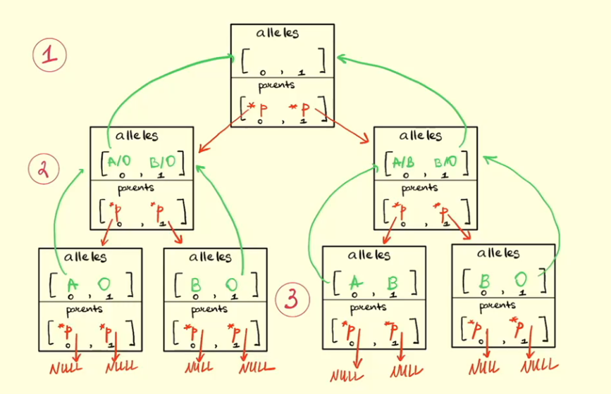

**Inheritance**

**Problem to Solve**

A person’s blood type is determined by two alleles (i.e., different forms of a gene). The three possible alleles are A, B, and O, of which each person has two (possibly the same, possibly different). Each of a child’s parents randomly passes one of their two blood type alleles to their child. The possible blood type combinations, then, are: OO, OA, OB, AO, AA, AB, BO, BA, and BB.

For example, if one parent has blood type AO and the other parent has blood type BB, then the child’s possible blood types would be AB and OB, depending on which allele is received from each parent. Similarly, if one parent has blood type AO and the other OB, then the child’s possible blood types would be AO, OB, AB, and OO.

The program should simulate the inheritance of blood types for each member of a family.


**Implementation Details**

Complete the implementation of `inheritance.c`, such that it creates a family of a specified generation size and assigns blood type alleles to each family member. The oldest generation will have alleles assigned randomly to them.

The `create_family` function takes an integer (`generations`) as input and should allocate (as via `malloc`) one `person` for each member of the family of that number of generations, returning a pointer to the `person` in the youngest generation.
* For example, `create_family(3)` should return a pointer to a person with two parents, where each parent also has two parents.
* Each `person` should have `alleles` assigned to them. The oldest generation should have alleles randomly chosen (as by calling the `random_allele` function), and younger generations should inherit one allele (chosen at random) from each parent.
* Each `person` should have `parents` assigned to them. The oldest generation should have both `parents` set to `NULL`, and younger generations should have `parents` be an array of two pointers, each pointing to a different parent.

<br>
<br>

How to test:
```
$ ./inheritance
```