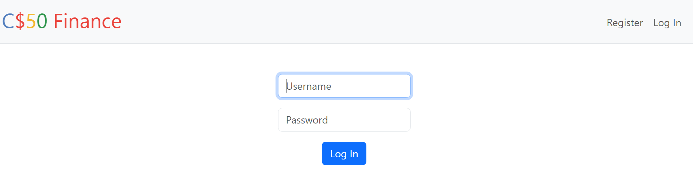
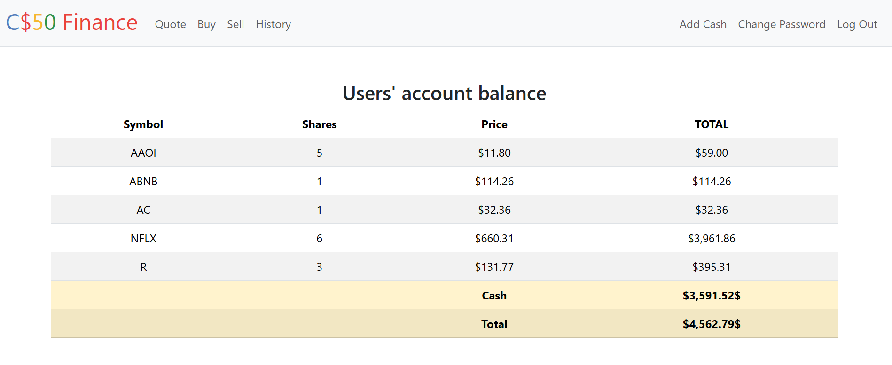
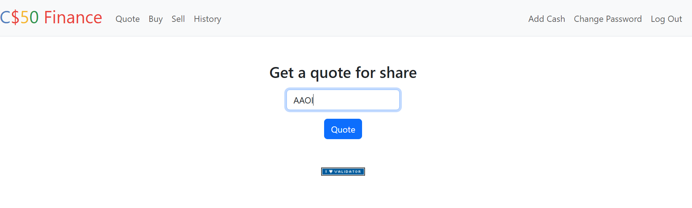
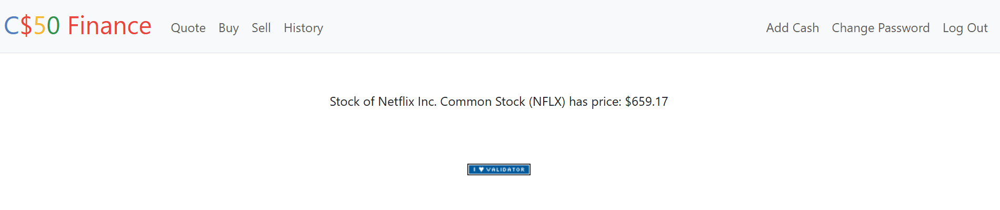
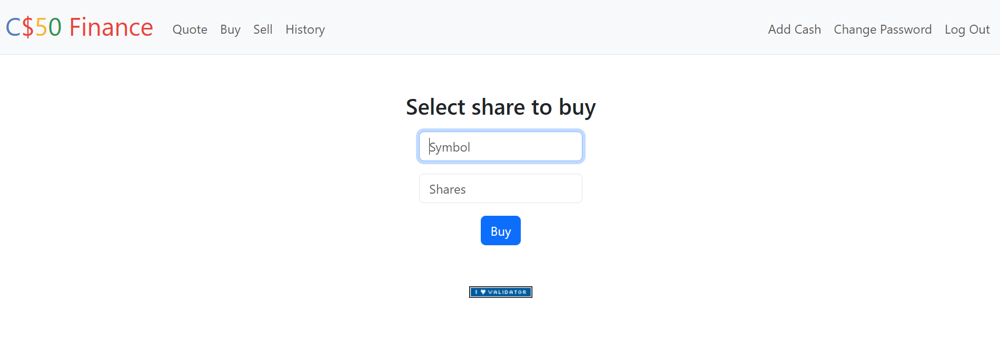
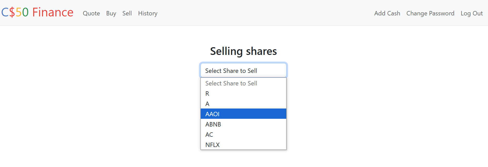
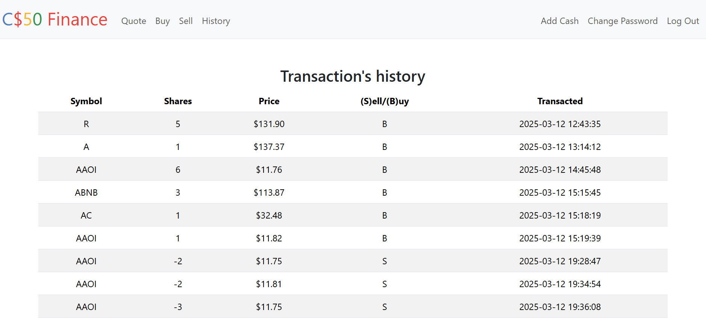

**C$50 Finance**

Implement a website via which users can “buy” and “sell” stocks, à la the below.

**Background**

You’re about to implement C$50 Finance, a web app via which you can manage portfolios of stocks. Not only will this tool allow you to check real stocks’ prices and portfolios’ values, it will also let you buy (okay, “buy”) and sell (okay, “sell”) stocks by querying for stocks’ prices.

Indeed, there are tools (one is known as IEX) that let you download stock quotes via their API (application programming interface) using URLs like 

https://api.iex.cloud/v1/data/core/quote/nflx?token=API_KEY.
 
Notice how Netflix’s symbol (NFLX) is embedded in this URL; that’s how IEX knows whose data to return. That link won’t actually return any data because IEX requires you to use an API key, but if it did, you’d see a response in JSON (JavaScript Object Notation).

**install needed libraries and modules**

`pip install -r requirements.txt`

**run flask app**

`flask run`