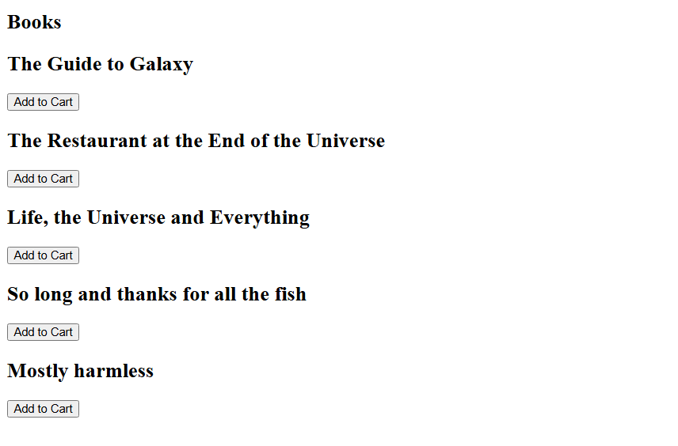
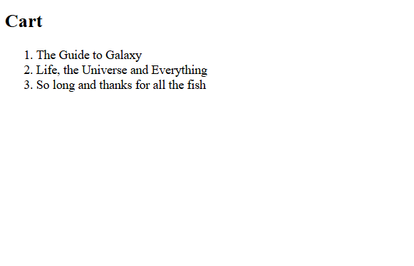

Simple shopping cart

# create store DB
sqlite3 store.db

# create table in DB
sqlite> CREATE TABLE books (id INTEGER, title TEXT NOT NULL, PRIMARY KEY(id));

# check schema in DB
sqlite> .schema

# add some data to table
sqlite> INSERT INTO books (id, title) VALUES (1, "The Guide to Galaxy");
sqlite> INSERT INTO books (id, title) VALUES (2, "The Restaurant at the End of the Universe");
sqlite> INSERT INTO books (id, title) VALUES (3, "Life, the Universe and Everything");
sqlite> INSERT INTO books (id, title) VALUES (4, "So long and thanks for all the fish");
sqlite> INSERT INTO books (id, title) VALUES (5, "Mostly harmless");

