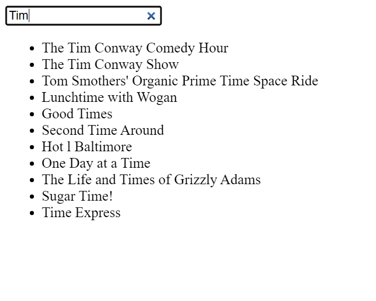

# example of sql query without submit button, but with JavaScript used to generating html code client-side and API and JSON.
# you can try to type `The` or `Tim` to get shows containing "The"/"Tim" in the name.

# start flask with command
flask run

