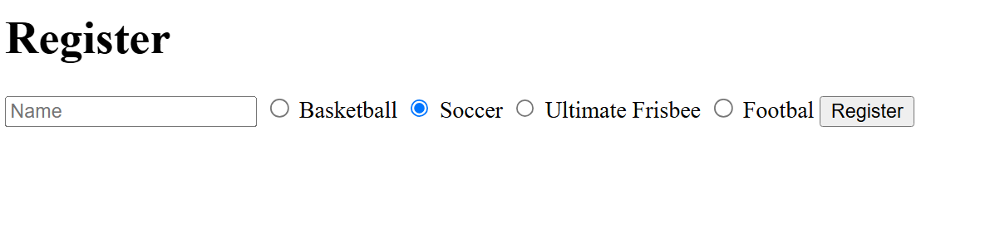

# server side validation of form data from index.html
# radio buttons for element select in index.html
# storing data in sqlite3 DB

# enter sqlite3 database (and create sports.db file)
sqlite3 sports.db

# create table in DB
sqlite> CREATE TABLE registrants (id INTEGER, name TEXT NOT NULL, sport TEXT NOT NULL, PRIMARY KEY(id));

# display existing tables in DB
sqlite> .schema
